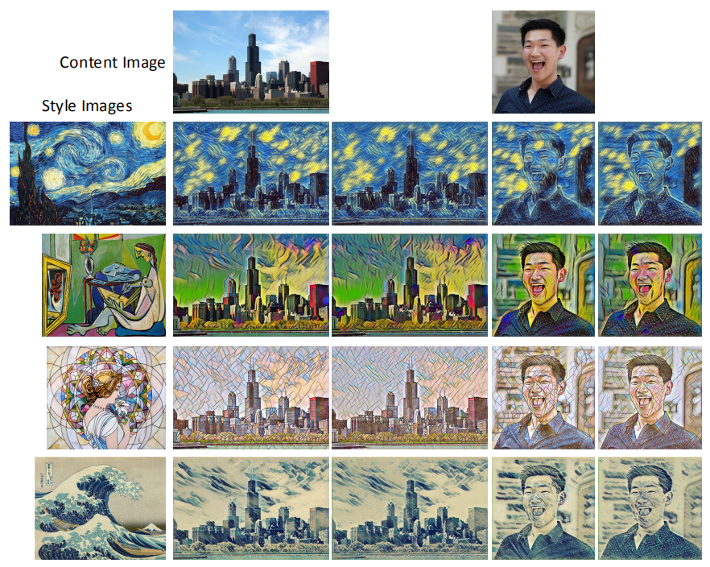
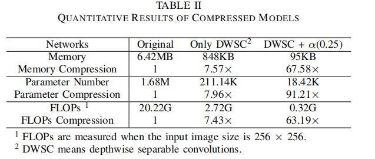

# LITNet: A Light-weight Image Transform Net for Image Style Transfer

## Descriptions
This is a PyTorch implementation of ***LITNet: A Light-weight Image Transform Net for Image Style Transfer*** published on the IJCNN 2021.

Recently, style transfer networks have received widespread attention in computer vision field, which combine stylistic features from a style image and content information from a content image to generate an output. 
However, the high-resolution synthesized outputs come at the cost of intensive computation, making it difficult to employ style transfer networks on embedded devices with limited computational resources. To address this issue, we propose a compression algorithm for one of the influential CNN-based style transfer networks, which is named as Image Transform Net (ITNet), and gain a Light-weight Image Transform Net (LITNet) accordingly.

Our main contributions are:
* We design a compression method for the Image Transform Net and propose a Light-weight Image Transform Net accordingly. 
* Normalization layers and the structure of upsampling blocks are changed, and depthwise separable convolutions with width multiplier are employed to obtain a novel light-weight model.  
* A pioneering distillation loss is designed to convert unsupervised learning into supervised learning, and weights between the distillation loss, style reconstruction loss, and content reconstruction loss are balanced to generate satisfactory outputs.
* Extensive experimental results have shown that the proposed LITNet can achieve up to 67$\times$ compression in model size, and more than 63$\times$ reduction in FLOPs while preserving the visual quality.


## Prerequisites
- Python 3.6.10
- PyTorch 1.4.0
- NumPy 1.18.1
- TorchVision 0.5.0
- TorchSummary 1.5.1
- ptflops 0.6.4

<!-- ## Usage -->
## Installation
* Clone this repo:

```bash
git clone https://github.com/shihuihong214/LITNet
```


* Download datasets from [COCO](https://academictorrents.com/download/f993c01f3c268b5d57219a38f8ec73ee7524421a.torrent) and unzip them to datasets folder.
* Download pre-trained models, content images and style images  from [Google Drive](https://drive.google.com/drive/folders/1bRwQ3Ak3clOjKoNh4RAGGj8WhPwTHbWq?usp=sharing) and unzip them to models folder.

Then you get the directory & file structure like this:

```
|---content_imgs
|---COCO
|   └───train2014
|   └───val2014
|---models
|  └───la_muse
|       └───compressed.model
|       └───original.model
|  └───mosaic
|       └───compressed.model
|       └───original.model
|  └───starry_night_crop
|       └───compressed.model
|       └───original.model
|  └───wave_crop
|       └───compressed.model
|       └───original.model
|---result
|---style_imgs
|---visualization
|---flops.py
|---main.py
|---network.py
|---style.py
|---train.sh
|---utils.py
|---vgg.py

```
## Quick Testing
### Test the ITNet using the given pre-trained models
You can stylize an image with a pretraind model with the following command:
```bash
$ python main.py transfer \
--model_path "path_to_pre-trained_ITNet" \
--source "path_to_test_image" \
--output "path_to_output_image" \
--gpu "gpu_ids"
```
```bash
eg:
$ python main.py transfer \
--model_path models/wave_crop/original.model \
--source content_imgs/dan.jpg \
--output resualt/wave_crop/dan_orginal.jpg \
--gpu 0
```
Here are some explanations about the options:
* `--transfer`: the testing process of the pre-trained network
* `--gpu`: id of the GPU you want to use (if not specified, will train on CPU)

### Test the LITNet using the given pre-trained models
You can stylize an image with a pretraind model with the following command:
```bash
$ python style.py transfer \
--model_path "path_to_pre-trained_LITNet" \
--source "path_to_test_image" \
--output "path_to_output_image" \
--gpu "gpu_ids"
```
```bash
eg:
$ python style.py transfer \
--model_path models/wave_crop/compressed.model \
--source content_imgs/dan.jpg \
--output resualt/wave_crop/dan_orginal.jpg \
--gpu 0
```
Here are some explanations about the options:
* `--transfer`: the testing process of the pre-trained network
* `--gpu`: id of the GPU you want to use (if not specified, will train on CPU)

## Train the LITNet
### First train the corresponding ITNet

You can train a model for a given style image with the following command:

```bash
$ python main.py train \
--style_image "path_to_style_image" \
--test_image "path_to_test_image" \
--dataset "path_to_coco" \
--gpu "gpu_ids" --visualize 1
```

```
eg:
$ python main.py train \
--style_image style_imgs/starry_night_crop.jpg \
--test_image content_imgs/chicago.jpg \
--dataset /COCO \
--gpu 0 --visualize 1
```

Here are some explanations about the options:
* `--train`: the training process of the network
* `--visualize`: visualize the style transfer of the test image every 1000 iterations during the training process in a folder called "visualize"

### Then train the LITNet

You can train a model for a given style image with the following command:

```bash
$ python style.py train \
--style_image "path_to_style_image" \
--test_image "path_to_test_image" \
--dataset "path_to_coco" \
--gpu "gpu_ids" --visualize 1
```

```
eg:
$ python style.py train \
--style_image style_imgs/starry_night_crop.jpg \
--test_image content_imgs/chicago.jpg \
--dataset /COCO \
--gpu 0 --visualize 1
```
Here are some explanations about the options:
* `--train`: the training process of the network
* `--visualize`: visualize the style transfer of the test image every 1000 iterations during the training process in a folder called "visualize"

## Results

Model trained on mosaic.jpg applied to a few images: 
<p align="center">
    
</p>

<p align="center">
    
</p>

## Citation

If you find this codebase is useful for your research, please cite:

````
@inproceedings{LITNet,
title={LITNet: A Light-weight Image Transform Net for Image Style Transfer},
author={Huihong Shi, Wendong Mao, and Zhongfeng Wang},
booktitle={2021 International Joint Conference on Neural Networks},
year={2021},
}
````

<!-- ## Acknowledgements
* This repo is based on code found in [this PyTorch example repo](https://github.com/pytorch/examples/tree/master/fast_neural_style) -->


